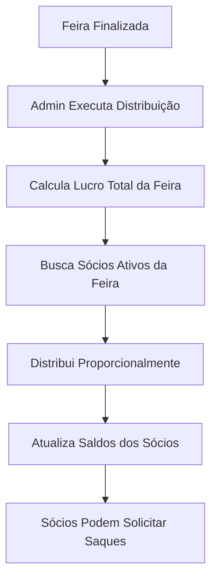
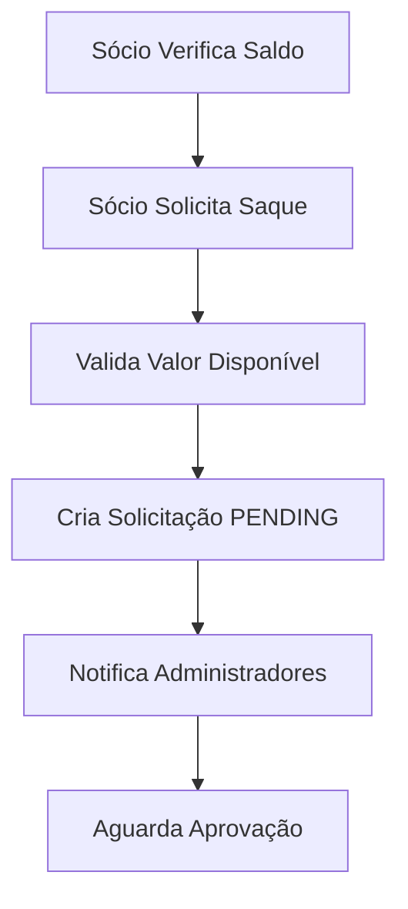
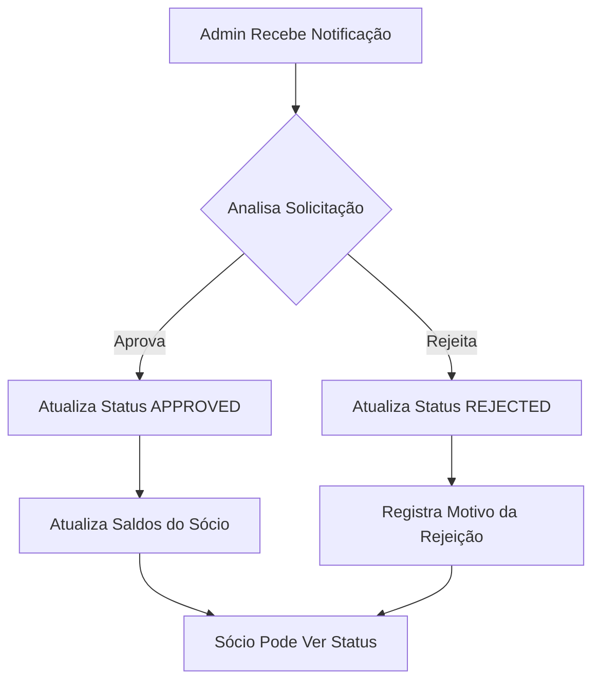

# 💰 Sistema de Saques dos Sócios - Documentação Completa

## 📋 **Visão Geral**

O sistema de saques permite que sócios solicitem retiradas de seus lucros acumulados, com controle total de aprovação pelos administradores. O fluxo é dividido em três etapas principais: **Distribuição de Lucros**, **Solicitação de Saques** e **Aprovação/Rejeição**.

---

## 🏗️ **Arquitetura do Sistema**

### **Entidades Principais**

#### **1. Partner (Sócio)**
```typescript
{
  id: string;                    // UUID único
  userId: string;                // Referência ao usuário
  name: string;                  // Nome completo
  cpf: string;                   // CPF único
  totalEarnings: number;         // Total ganho (todas as feiras)
  totalWithdrawn: number;        // Total já sacado
  availableBalance: number;      // Saldo disponível para saque
  isActive: boolean;             // Status ativo/inativo
  createdAt: Date;
  updatedAt: Date;
}
```

#### **2. PartnerWithdrawal (Solicitação de Saque)**
```typescript
{
  id: string;                    // UUID da solicitação
  partnerId: string;             // ID do sócio
  amount: number;                // Valor solicitado
  status: 'PENDING' | 'APPROVED' | 'REJECTED' | 'COMPLETED';
  reason?: string;               // Motivo do saque
  rejectionReason?: string;      // Motivo da rejeição
  approvedBy?: string;           // ID do admin que aprovou
  approvedAt?: Date;             // Data da aprovação
  bankDetails?: string;          // Dados bancários
  notes?: string;                // Observações
  createdAt: Date;
  updatedAt: Date;
}
```

#### **3. FairPartner (Participação na Feira)**
```typescript
{
  id: string;                    // UUID único
  fairId: string;                // ID da feira
  partnerId: string;             // ID do sócio
  percentage: number;            // Porcentagem de participação
  isActive: boolean;             // Status ativo na feira
  earnings: number;              // Ganhos específicos desta feira
  createdAt: Date;
  updatedAt: Date;
}
```

---

## 🔄 **Fluxo Completo do Sistema**

### **Etapa 1: Distribuição de Lucros**


### **Etapa 2: Solicitação de Saques**


### **Etapa 3: Aprovação/Rejeição**


---

## 🛠️ **Endpoints da API**

### **1. Distribuição de Lucros**

#### **POST /cash-flow/distribute-profit/:fairId**
Distribui o lucro de uma feira entre os sócios ativos.

**Headers:**
```http
Authorization: Bearer {jwt-token}
Content-Type: application/json
```

**Resposta (200):**
```json
{
  "fairId": "fair-uuid-123",
  "totalProfit": 150000.00,
  "distribution": [
    {
      "partnerId": "partner-uuid-1",
      "partnerName": "João Silva Santos",
      "percentage": 40.0,
      "share": 60000.00
    },
    {
      "partnerId": "partner-uuid-2", 
      "partnerName": "Maria Oliveira",
      "percentage": 60.0,
      "share": 90000.00
    }
  ]
}
```

**Validações:**
- ✅ Apenas administradores podem executar
- ✅ Feira deve ter lucro positivo
- ✅ Soma das porcentagens não pode exceder 100%

---

### **2. Gestão de Saques**

#### **POST /partners/:id/withdrawals**
Solicita um saque do saldo disponível.

**Headers:**
```http
Authorization: Bearer {jwt-token}
Content-Type: application/json
```

**Body:**
```json
{
  "amount": 5000.00,
  "reason": "Retirada mensal de lucros",
  "bankDetails": "Banco: 001, Agência: 1234, Conta: 56789-0",
  "notes": "Transferência urgente"
}
```

**Resposta (201):**
```json
{
  "id": "withdrawal-uuid-123",
  "partnerId": "partner-uuid-1",
  "amount": 5000.00,
  "status": "PENDING",
  "reason": "Retirada mensal de lucros",
  "bankDetails": "Banco: 001, Agência: 1234, Conta: 56789-0",
  "notes": "Transferência urgente",
  "createdAt": "2025-09-11T15:30:00.000Z",
  "updatedAt": "2025-09-11T15:30:00.000Z"
}
```

**Validações:**
- ✅ Valor mínimo: R$ 0,01
- ✅ Valor máximo: Saldo disponível do sócio
- ✅ Sócio só pode solicitar para si mesmo (ou admin para qualquer um)

#### **GET /partners/:id/withdrawals**
Lista o histórico de saques de um sócio.

**Resposta (200):**
```json
[
  {
    "id": "withdrawal-uuid-1",
    "partnerId": "partner-uuid-1",
    "amount": 5000.00,
    "status": "APPROVED",
    "reason": "Retirada mensal de lucros",
    "approvedBy": "admin-uuid",
    "approvedAt": "2025-09-11T16:00:00.000Z",
    "bankDetails": "Banco: 001, Agência: 1234, Conta: 56789-0",
    "notes": "Transferência urgente",
    "createdAt": "2025-09-11T15:30:00.000Z",
    "updatedAt": "2025-09-11T16:00:00.000Z"
  },
  {
    "id": "withdrawal-uuid-2",
    "partnerId": "partner-uuid-1",
    "amount": 2000.00,
    "status": "PENDING",
    "reason": "Emergência médica",
    "bankDetails": "Banco: 341, Ag: 5678, Conta: 12345-6",
    "createdAt": "2025-09-11T18:00:00.000Z",
    "updatedAt": "2025-09-11T18:00:00.000Z"
  }
]
```

---

### **3. Aprovação e Rejeição**

#### **POST /partners/withdrawals/:withdrawalId/approve**
Aprova uma solicitação de saque.

**Headers:**
```http
Authorization: Bearer {jwt-token}
```

**Resposta (200):**
```json
{
  "id": "withdrawal-uuid-123",
  "partnerId": "partner-uuid-1",
  "amount": 5000.00,
  "status": "APPROVED",
  "reason": "Retirada mensal de lucros",
  "approvedBy": "admin-uuid",
  "approvedAt": "2025-09-11T16:00:00.000Z",
  "bankDetails": "Banco: 001, Agência: 1234, Conta: 56789-0",
  "notes": "Transferência urgente",
  "createdAt": "2025-09-11T15:30:00.000Z",
  "updatedAt": "2025-09-11T16:00:00.000Z"
}
```

**O que acontece:**
- ✅ Status muda para `APPROVED`
- ✅ `totalWithdrawn` do sócio aumenta
- ✅ `availableBalance` do sócio diminui
- ✅ Registra quem aprovou e quando

#### **POST /partners/withdrawals/:withdrawalId/reject**
Rejeita uma solicitação de saque.

**Headers:**
```http
Authorization: Bearer {jwt-token}
Content-Type: application/json
```

**Body:**
```json
{
  "rejectionReason": "Dados bancários incorretos. Favor verificar agência e conta."
}
```

**Resposta (200):**
```json
{
  "id": "withdrawal-uuid-123",
  "partnerId": "partner-uuid-1",
  "amount": 5000.00,
  "status": "REJECTED",
  "reason": "Retirada mensal de lucros",
  "rejectionReason": "Dados bancários incorretos. Favor verificar agência e conta.",
  "bankDetails": "Banco: 001, Agência: 1234, Conta: 56789-0",
  "notes": "Transferência urgente",
  "createdAt": "2025-09-11T15:30:00.000Z",
  "updatedAt": "2025-09-11T16:30:00.000Z"
}
```

---

### **4. Consultas Financeiras**

#### **GET /partners/:id/financial-summary**
Retorna o resumo financeiro de um sócio.

**Resposta (200):**
```json
{
  "totalEarnings": 25000.00,      // Total ganho (todas as feiras)
  "totalWithdrawn": 8000.00,      // Total já sacado
  "availableBalance": 17000.00,   // Saldo disponível para saque
  "pendingWithdrawals": 2000.00,  // Saques pendentes de aprovação
  "totalWithdrawals": 5           // Número total de saques
}
```

#### **GET /partners/available-percentage**
Retorna a porcentagem máxima disponível para novos sócios.

**Resposta (200):**
```json
{
  "availablePercentage": 60.0,    // Porcentagem máxima disponível
  "usedPercentage": 40.0,         // Porcentagem já utilizada
  "totalPercentage": 100          // Total (sempre 100%)
}
```

---

## 🔒 **Controle de Acesso e Validações**

### **Permissões por Role**

| Ação | Admin | Sócio | Consultor |
|------|-------|-------|-----------|
| Distribuir lucros | ✅ | ❌ | ❌ |
| Solicitar saque | ✅ (para qualquer) | ✅ (apenas próprio) | ❌ |
| Aprovar saque | ✅ | ❌ | ❌ |
| Rejeitar saque | ✅ | ❌ | ❌ |
| Ver histórico próprio | ✅ | ✅ | ❌ |
| Ver histórico de outros | ✅ | ❌ | ❌ |
| Ver resumo financeiro | ✅ | ✅ (apenas próprio) | ❌ |

### **Validações Financeiras**

#### **Solicitação de Saque**
- ✅ **Valor mínimo**: R$ 0,01
- ✅ **Valor máximo**: Não pode exceder `availableBalance`
- ✅ **Status**: Apenas saques `PENDING` podem ser aprovados/rejeitados
- ✅ **Dados bancários**: Obrigatório para processamento

#### **Distribuição de Lucros**
- ✅ **Lucro positivo**: Feira deve ter lucro > 0
- ✅ **Sócios ativos**: Apenas sócios ativos na feira recebem
- ✅ **Porcentagens**: Soma não pode exceder 100%
- ✅ **Proporcionalidade**: Distribuição baseada na porcentagem de cada sócio

---

## 📊 **Status dos Saques**

| Status | Descrição | Ação Possível | Impacto no Saldo |
|--------|-----------|---------------|------------------|
| `PENDING` | Aguardando aprovação do admin | Aprovar ou Rejeitar | Nenhum |
| `APPROVED` | Aprovado pelo admin | - | Diminui `availableBalance` |
| `REJECTED` | Rejeitado pelo admin | - | Nenhum |
| `COMPLETED` | Processado/Concluído | - | Já impactado |

---

## 💡 **Exemplos de Uso**

### **Exemplo 1: Fluxo Completo de um Sócio**

```javascript
// 1. Sócio verifica seu saldo disponível
const summary = await api.get('/partners/me/financial-summary');
console.log(`Saldo disponível: R$ ${summary.availableBalance}`);

// 2. Sócio solicita um saque
const withdrawal = await api.post('/partners/me/withdrawals', {
  amount: 5000.00,
  reason: 'Retirada mensal de lucros',
  bankDetails: 'Banco: 001, Ag: 1234, Conta: 56789-0',
  notes: 'Transferência para conta corrente'
});

console.log(`Saque solicitado: ${withdrawal.id}`);

// 3. Sócio acompanha o status
const status = await api.get(`/partners/me/withdrawals/${withdrawal.id}`);
console.log(`Status atual: ${status.status}`);

// 4. Após aprovação, verifica novo saldo
const newSummary = await api.get('/partners/me/financial-summary');
console.log(`Novo saldo: R$ ${newSummary.availableBalance}`);
```

### **Exemplo 2: Admin Gerenciando Saques**

```javascript
// 1. Admin distribui lucro de uma feira
const distribution = await api.post('/cash-flow/distribute-profit/feira-123');
console.log(`Lucro total distribuído: R$ ${distribution.totalProfit}`);

// 2. Admin lista todos os saques pendentes
const pendingWithdrawals = await api.get('/partners/withdrawals?status=PENDING');

// 3. Admin aprova um saque
await api.post(`/partners/withdrawals/${withdrawalId}/approve`);

// 4. Admin rejeita outro saque
await api.post(`/partners/withdrawals/${withdrawalId}/reject`, {
  rejectionReason: 'Dados bancários incorretos'
});
```

### **Exemplo 3: Cálculo de Distribuição**

```javascript
// Cenário: Feira com R$ 100.000 de lucro
// Sócio A: 40% de participação
// Sócio B: 60% de participação

const distribution = await api.post('/cash-flow/distribute-profit/feira-123');

// Resultado:
// Sócio A recebe: R$ 40.000 (40% de R$ 100.000)
// Sócio B recebe: R$ 60.000 (60% de R$ 100.000)

distribution.distribution.forEach(partner => {
  console.log(`${partner.partnerName}: ${partner.percentage}% = R$ ${partner.share}`);
});
```

---

## 🚨 **Tratamento de Erros**

### **Erros Comuns**

#### **400 Bad Request**
```json
{
  "statusCode": 400,
  "message": "Valor solicitado excede o saldo disponível",
  "error": "Bad Request"
}
```

#### **403 Forbidden**
```json
{
  "statusCode": 403,
  "message": "Apenas administradores podem aprovar saques",
  "error": "Forbidden"
}
```

#### **404 Not Found**
```json
{
  "statusCode": 404,
  "message": "Solicitação de saque não encontrada",
  "error": "Not Found"
}
```

#### **409 Conflict**
```json
{
  "statusCode": 409,
  "message": "Esta solicitação já foi processada",
  "error": "Conflict"
}
```

---

## 🔧 **Configurações e Limites**

### **Limites do Sistema**
- **Valor mínimo de saque**: R$ 0,01
- **Valor máximo de saque**: Limitado pelo saldo disponível
- **Máximo de sócios por feira**: Sem limite (mas soma das porcentagens ≤ 100%)
- **Histórico de saques**: Mantido indefinidamente

### **Configurações de Banco**
- **Precisão decimal**: 15 dígitos totais, 2 casas decimais
- **Moeda**: Real brasileiro (R$)
- **Timezone**: UTC (conversão automática para local)

---

## 📈 **Métricas e Relatórios**

### **Métricas Disponíveis**
- Total de saques por período
- Valor total sacado por sócio
- Tempo médio de aprovação
- Taxa de rejeição de saques
- Distribuição de lucros por feira

### **Relatórios Sugeridos**
- Relatório mensal de saques
- Análise de performance por sócio
- Histórico de distribuições de lucro
- Dashboard de aprovações pendentes

---

## 🛡️ **Segurança e Auditoria**

### **Logs de Auditoria**
- Todas as ações são logadas com timestamp
- Identificação do usuário que executou a ação
- Valores e dados relevantes registrados
- Rastreabilidade completa do fluxo

### **Validações de Segurança**
- Verificação de permissões em cada endpoint
- Validação de dados de entrada
- Prevenção de saques duplicados
- Controle de acesso baseado em roles

---

## 📞 **Suporte e Documentação**

### **Documentação Swagger**
Acesse a documentação interativa em: `http://localhost:8000/api`

### **Tags Relevantes**
- `partners` - Gestão de sócios e saques
- `finance-cash-flow` - Distribuição de lucros
- `fair-partners` - Participação em feiras

### **Contato**
Para dúvidas sobre implementação ou bugs, consulte a documentação técnica ou entre em contato com a equipe de desenvolvimento.

---

*Documentação atualizada em: 11/09/2025*
*Versão da API: 1.0.0*
